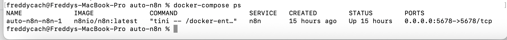
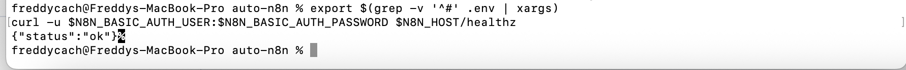

## Variables de entorno

- N8N_BASIC_AUTH_ACTIVE  
- N8N_BASIC_AUTH_USER  
- N8N_BASIC_AUTH_PASSWORD  
- N8N_HOST

## docker-compose.yml

```yaml

services:
  n8n:
    image: n8nio/n8n:latest
    restart: unless-stopped
    ports:
      - "5678:5678"
    environment:
      - N8N_BASIC_AUTH_ACTIVE=${N8N_BASIC_AUTH_ACTIVE}
      - N8N_BASIC_AUTH_USER=${N8N_BASIC_AUTH_USER}
      - N8N_BASIC_AUTH_PASSWORD=${N8N_BASIC_AUTH_PASSWORD}
      - N8N_HOST=${N8N_HOST}
    volumes:
      - ./n8n_data:/home/node/.n8n```

## Verificación





